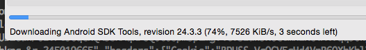

因为某些奇怪的原因，国内访问 Android 镜像的时候总是会失败，导致更新 Android SDK 的时候非常困难，虽然国内有一个 <http://www.androiddevtools.cn/> 收集了很多 Android 开发相关的资源。

但是对于我本人而言，使用这里面提供的代理服务器的时候，速度还是慢的跟蜗牛一样。另外我使用的是中国电信的宽带，虽然购买了 VPN 但是速度还是很不理想，可能也跟 [如何看待上海电信访问国外网站困难，并推出国际精品网、国际氮气瓶业务？](http://www.zhihu.com/question/31646893) 有些关系。

知乎上面也有一个相关的话题讨论 [谷歌不能访问了 怎么构建安卓开发环境？](http://www.zhihu.com/question/32212970)

因此我开始考虑是否可以自己弄一个代理服务器，借助于百度网盘的CDN网络，提供更快的下载速度。

<!-- more -->

为了构建这个代理服务器，首先需要有资源。

我直接使用了百度网盘的离线下载功能，把 <http://mirrors.neusoft.edu.cn/android/repository/> 的内容镜像了一次，这部分主要是人肉的工作，因为提交的 URL 多了之后，需要手工输入验证码，花费了大概2，3个小时的时间。

```
链接: http://pan.baidu.com/s/1mgGhdlm 密码: 526k
```

有了资源之后，就需要考虑如何通过代理服务器下载，代理服务器本质上就是一个 Web 服务器，当收到类似 `/android/repository/addons_list-1.xml` 的请求之后，就从百度网盘里面下载所需要的资源。

要自动获取百度网盘中资源的下载地址，需要先人肉登录，然后得到 BDUSS 和 BAIDUID 这两个 Cookie。相信对于大部分同学来说，应该不是很大的问题，只需要在 Chrome Dev Tools 里面看看 Request Header 就能得到这部分数据了。

有了 `BDUSS` 和 `BAIDUID` 这两个 Cookie 之后，把上面的分享的内容转存到自己网盘的`根目录`，然后下载这部分的代码：

```
git clone https://github.com/leeight/baidu-cloud-mirror.git
cd baidu-cloud-mirror
npm install
DEBUG=* node main.js --bduss=$BDUSS --baiduid=$BAIDUID --port=8964
```

然后就可以通过 `wget http://localhost:8964/android/repository/samples-22_r06.zip` 测试下载速度了。

对于我的 `100M` 电信宽带来说，未开通了百度网盘会员之前，下载速度在 `300K` 左右，开通了之后，下载速度是 `6M ~ 7M` 左右。


