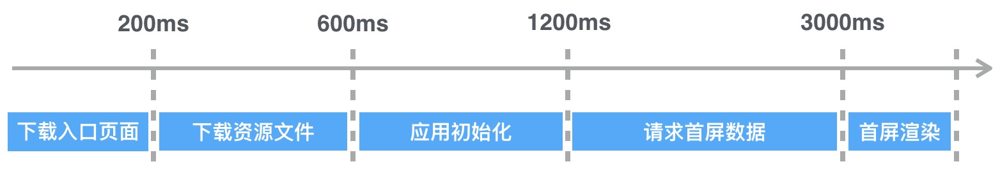
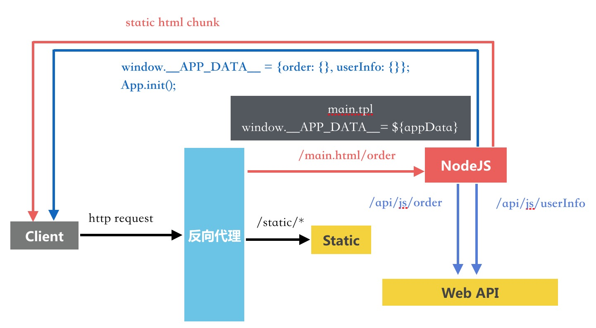
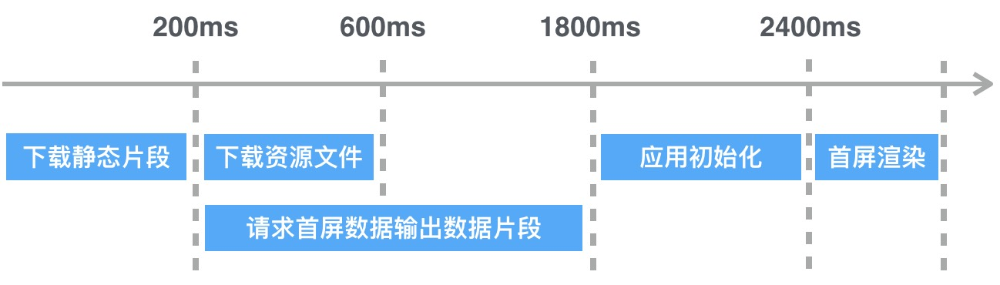
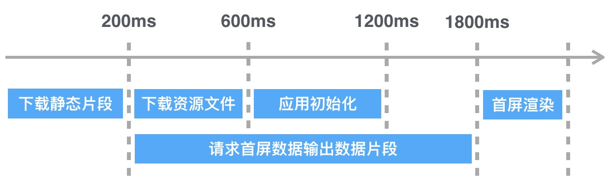

## 背景

单页式应用是近几年来前端技术栈发展与落地的最典型场景，Angular，Vue，React这些相关的技术栈目的都是从架构层面为单页式应用提供研发解决方案，着重解决单页式应用的研发效率。基础框架的进化也催生着关联工具链路的发展，如 yeoman，grunt -> gulp -> 各种 cli，webpack1/2, babel 等。

随着整个研发链路的稳定成熟，在渐进式改造历史项目的同时，我们也开始了对单页式应用性能优化的初步探索。

以下介绍我们尝试的第一个性能优化方案： 基于 HTTP Chunk 的首屏数据预加载。该方案与同构渲染类似但又不同，文章后面会比较这两种方案各自的优缺点。

## 单页式应用首屏呈现节点

在着手优化之前，我们先梳理下单页式应用首屏呈现的各个节点。绝大多数的单页式应用都符合 [Application Shell](https://developers.google.com/web/fundamentals/architecture/app-shell) 架构，
以下根据这个架构列出我们其中一个系统首屏呈现的各个节点以及相关耗时数据：

1. 下载入口页面：这里主要的耗时在 HTTP 连接建立的往返开销，约 200ms；

2. 下载资源文件：构建优化后一般是应用启动和渲染首屏必须的最小资源，我们在登录页做了资源的预加载，所以应用资源可以认为都是读浏览器缓存，约 400ms；

3. 应用初始化：包括基础框架和应用层框架的初始化，我们的应用较为复杂，整个初始化过程会稍微长些，约 600ms；

4. 首屏组件初始化请求首屏数据：我们应用首页主要以可视化报表为主，查询耗时较久，耗时约 1800ms；

5. 首屏渲染：耗时忽略

以上5步结束后，首屏完整呈现给用户，整个流程很明显的特点是各个节点都是串行，所以应用首屏呈现的时间为各个节点时间消耗的总和: ** T(S) = T(1) + T(2) + T(3) + T(4) + T(5) = 3000ms**;

整个首屏呈现 timeline 如下：



根据上面的节点数据，首屏数据预加载方案的优化思路也得到了体现：

1. 优化首屏数据加载节点的速度

2. 预先加载首屏数据，使得多个串行节点并行化

接下来详细介绍我们的优化步骤。第1点会在第一步优化中体现，但核心思路和主要优化收益更多体现在第2点：**串行节点并行化。**

## Step1：资源文件下载与首屏数据请求节点并行

整个方案充分利用了**HTTP Chunk传输与浏览器的增量渲染特性**来完成节点并行化。

我们将入口页分为静态片段和数据片段：静态片段包含了各个资源标签（script,link），静态的导航栏，加载指示器等；数据片段则是包含首屏数据的内联脚本，大至如下： 

```html 
<script>
window.__APP_DATA__ = { /* 相关的首屏数据 */ };
</script>
```
浏览器请求入口页时，页面服务器（这里我们将 Nginx 换成了 NodeJS 来满足动态页面渲染）首先将静态片段输出给浏览器，同时请求首屏数据，当数据请求完成后，再将数据片段和应用初始化代码返回给浏览器。chunk 方式输出在 NodeJS 中及其容易满足，简单的 ```res.write(chunk)``` 即可。

整体架构如下：



浏览器的增量渲染特性在收到静态片段并解析后立刻去下载资源，由此巧妙的将下载资源文件节点和首屏数据请求节点并行化，当应用初始化完毕后，首屏组件直接读取```window.__APP_DATA__```拿到数据渲染即可。

整个首屏呈现 timeline 变化如下：



1. 下载静态片段：基本和未优化前没有什么变化，主要耗时在连接建立开销，依然是 200ms；
  
2. 请求首屏数据并输出片段：相比未优化前共用了入口页面的连接，因此节约了请求创建开销，根据经验和数据这里耗时**从 1800ms 降为 1600ms**；
下载资源文件：耗时 400ms；
下载资源文件的时机需要在静态片段返回给浏览器后进行，基本等于下载入口页面的时间，**最终并行化耗时大致为：Max(下载资源文件，请求首屏数据输出片段) = 1600ms。**

3. 应用初始化：耗时 600ms

4. 首屏渲染：耗时忽略

根据变化后的节点我们算出首屏呈现时间为：**T(S) = T(1) + T(2) + T(3) + T(4) = 2400ms**

首屏呈现耗时的通用计算公式变为：

**下载入口页 + Max(下载资源文件，请求首屏数据) + 应用初始化 + 首屏渲染**

## Step2：应用初始化，资源文件下载，首屏数据请求节点并行

在 Step1 的基础上继续分析，应用初始化节点耗时也很明显，同时该节点要进行必须等待资源文件下载完毕，但理论上可以不依赖我们的首屏数据，还是可以让其和首屏数据请求并行。

这里我们无法在 Step1 方案上直接将应用初始化和数据请求并行化，主要的原因是当首屏数据请求时间大于下载资源文件+应用初始化完成时间时，应用会在没有数据的情况下进入收入首屏渲染节点，此时会发生异常。

我们的解决方案是将数据片段的输出变成promise片段：

1. pending promise 片段，与静态片段一起输出，大概如下：

  ```html
  <script>
  window.__APP_DATA__ = {
    RESOLVERS: {}
    userInfo: new Promise((resolve, reject) => {
      // 超时认为失败
      let timer = setTimeout(reject.bind(null, {message: 'timeout'}), 12000);
      window.__APP_DATA__.userInfo = (err, data) => {
        clearTimeout(timer);
        err ? reject(err) : resolve(data)
      }
    })
  };
  </script>
  ```
2. resolve promise 片段，该片段在数据请求成功返回后输出，大概如下：

  ```html
  <script>window.__APP_DATA__.RESOLVERS.userInfo(null, data); </script>
  ```

3. reject promise 片段，该片段在数据请求失败后输出，大概如下：

  ```html
  <script>window.__APP_DATA__.RESOLVERS.userInfo(error); </script>
  ```

即此时应用初始化完毕后可以无视首屏数据的完成度，直接进入首屏渲染节点，组件在数据promise被resolve后渲染即可：
```window.__APP_DATA__.userInfo.then(data => component.render());```

通过对数据片段的promise化改造，使得应用初始化节点也加入了并行队列。

整个首屏呈现 timeline 变化如下：



1. 下载静态片段：耗时 200ms

2. 下载资源文件：耗时 400ms
   请求首屏数据输出片段：耗时 1600ms
   应用初始化：耗时 600ms
   **最终并行化耗时为：Max(下载资源文件 + 应用初始化，请求首屏数据) = 1600ms。**

3. 首屏渲染：耗时忽略

根据变化后的节点我们算出首屏呈现时间为：**T(S) = T(1) + T(2) + T(3) = 1800ms**

首屏呈现耗时的通用计算公式变为：**下载静态片段 + Max(下载资源文件 + 应用初始化，请求首屏数据) + 首屏渲染**

## 优化小结

经过上述 2 个步骤改进，我们应用首屏呈现时间从 3000ms -> 2400ms -> 1800ms，**总体效果为40%**，可以看到收益还是很可观的。

当首屏数据请求数超过浏览器并发请求数时，该方案收益会更明显，因为 NodeJS 端没有并发限制，甚至在NodeJS端与后端服务的交互中可以采用更高效的协议如HTTP2来提高调用速度。

## 与同构渲染方案的对比

### 优势：

1. 对客户端代码来说 HTTP Chunk 的数据预加载方案实现成本较为简单，架构层面上可以做到较高程度的透明化，我们在实际的开发过程中采用基于 [uIoC](https://github.com/ecomfe/uioc) 提供的AOP拦截方案，通过配置化的方式让客户端的代码改造仅局限在配置文件，应用代码基本未改动。

2. 对 NodeJS 端来说，分层合理的应用只需要将数据层简单适配下 NodeJS 端即可完成数据预加载功能，这对基于未提供同构渲染方案的基础框架搭建的应用来说，整个改造成本可以说大大减小，且收益明显。我们目前的应用基于自有的一套MVC框架，仅仅是将 Model 层简单适配 NodeJS 端执行输出数据。

3. 同构渲染如果未能提供较方便的 BigPipe 渲染方案，总体的页面呈现速度是不如数据预加载方案的，且目前我也暂时还没有在三大框架中发现有一套基于 BigPipe 的同构解决方案。

### 不足：

整体呈现速度可能不如结合了 BigPipe 的同构渲染方案，但这点没有经过论证。

## 总结

我们在单页应用的性能优化上基于很朴素的并行化理念实施了基于HTTP Chunk的首屏数据预加载方案，在实际项目中也得到了较为明显的**40%提速**收益，最终推导出数据预加载方案的首屏呈现时间计算公式为：

**下载静态片段 + Max(下载资源文件 + 应用初始化，请求首屏数据) + 首屏渲染**

这里忽略了影响很小的片段传输时间，有打算尝试的朋友可以将自己应用的相关节点数据代入计算即可。

数据预加载，同构渲染，客户端渲染三种方案各有优缺和场景，个人未来的计划是将三种方案结合实时流量数据动态切换：在服务器压力不大时用同构渲染；服务器压力较大时用数据预加载；服务器压力很大时用客户端渲染。

